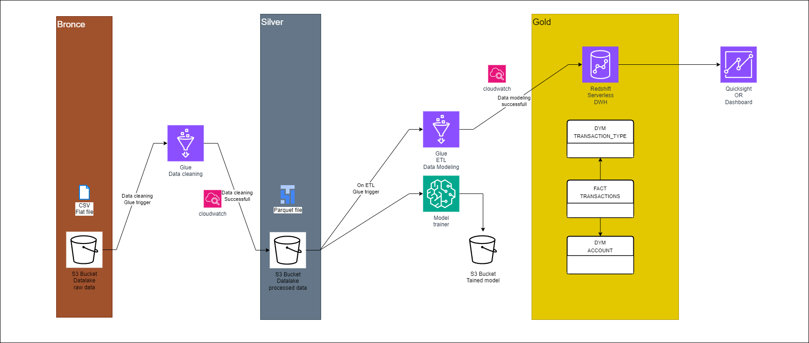
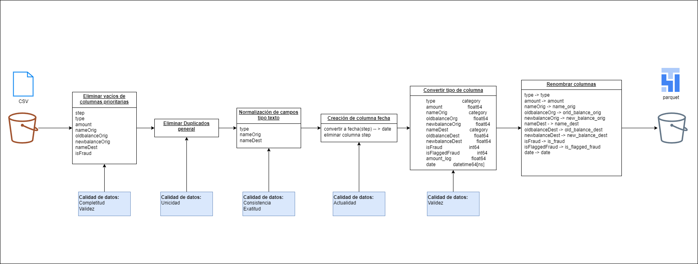
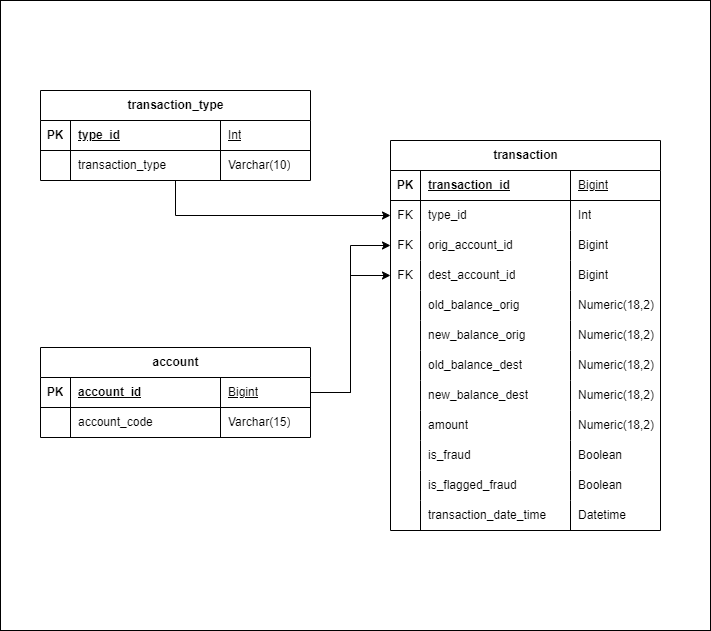

# Proyecto de Análisis y Modelado de Datos - Nequi Data Engineering

Este proyecto se centra en el diseño de una arquitectura para un pipeline de datos partiendo de un dataset con la finalidad de modelar el dataset en un servicio OLAP. El proyecto está diseñado para ser implementado dentro de la infraestructura de AWS sin embargo por cuestiones de reproducibilidad se implementaron algunas limitaciones en la estructuración del código.

## **Requisitos**

### **Dependencias**
- Python 3.8+
- Java (JDK 8+)
- Apache Spark
- Jupyter Notebook
- venv o Conda (versionado de python)

### **Instalación**
1. Clona el repositorio:
   ```bash
   git clone https://github.com/Pliperkiller/NequiDataEng.git
   cd NequiDataEng
   ```
   
2. Crea un entorno virtual:
   ```bash
   python -m venv venv
   ```

3. Activa el entorno virtual:
   - En Windows con CMD:
     ```bash
     venv\Scripts\activate
     ```
   - En Windows con Powershell:
     ```bash
     venv\Scripts\activate.ps1
     ```
   - En macOS/Linux:
     ```bash
     source venv/bin/activate
     ```

4. Instala las dependencias:
   ```bash
   pip install -r requirements.txt
   ```

## Ejecucion
Para ejecutar el proyecto siga los siguientes pasos
 1. Descargue el dataset desde [PaySim Dataset en Kaggle](https://www.kaggle.com/datasets/ealaxi/paysim1?resource=download) y agreguelo a la carpeta data/raw
 2. Ejecute el script data_cleaning.py este creará un parquet con la data procesada dentro de la carpeta data/processed
 3. Ejecute el script etl_pipeline.py este creará tres parquet, correspondientes al modelado de datos propuestos
 
```
NequiDataEng/
│
├── data/
│   ├── raw/                # Datos crudos (Bronce)
│   ├── processed/          # Datos procesados (Silver)
│   ├── modeled/            # Datos modelados (Gold)
│
├── notebooks/
│   ├── 01_EDA.ipynb        # Análisis exploratorio de datos
│
├── src/
│   ├── etl_pipeline.py     # Script principal del pipeline ETL
│   ├── data_cleaning.py    # Funciones de limpieza de datos
│
├── tests/
│   ├── test_data_cleaning.py   # Análisis exploratorio de datos
├── descripcion_dataset.readme  # Descripción del dataset
│
├── README.md               # Archivo README del proyecto
│
└── requirements.txt        # Dependencias del proyecto
```

---
---

# 1. **Descripcion de la arquitectura**




Esta arquitectura se basa en un enfoque de **tres capas**: **Bronze**, **Silver** y **Gold**, donde cada capa representa un nivel de limpieza y transformaciones de los datos, con el fin de habilitar un proceso de análisis y reporting más eficiente.

---

### 1. Capa Bronze
- **Fuente de Datos (S3 Bucket - Raw Data):**  
  Aquí se almacenan los datos en su formato **crudo** (sin transformaciones). Se utilizan archivos CSV u otros formatos que provienen de diversas fuentes (bases de datos transaccionales, streams, etc.).
- **CloudWatch (Monitoreo y Alertas):**  
  Se configura para rastrear la llegada de nuevos archivos al bucket y notificar u orquestar el siguiente paso del pipeline.

---

### 2. Capa Silver
- **AWS Glue (Data Cleaning):**  
  - Toma los datos crudos de la capa Bronze y aplica **limpieza** iniciales (data_cleaning.py).  
  - Esto puede incluir eliminación de duplicados, normalización de formatos y validaciones de integridad.
- **S3 Bucket (Processed Data):**  
  Los datos resultantes de la etapa de limpieza se almacenan en un segundo bucket de S3 en su formato **procesado**, listos para análisis exploratorios o transformaciones más específicas.
- **Glue ETL (Data Modeling):**  
  - Se ejecutan trabajos de Glue adicionales para realizar transformaciones de mayor complejidad y modelar la data para usos más específicos.  
  - Podrían incluirse validaciones más avanzadas, creación de columnas derivadas y un **enriquecimiento** de la información.
    
Nota: Los datos dentro del bucket Silver se disponibilizan para entrenamiento de modelos mediante AWS SageMaker.
---

### 3. Capa Gold
- **S3 Bucket (Modeled Data):**  
  Después de la fase de modelado, los datos altamente refinados (dataset "Gold") se almacenan en otro bucket de S3.
- **Redshift (Data Warehouse - DWH):**  
  - Se ingresa el conjunto de datos **Gold** en Amazon Redshift, un servicio de Data Warehouse que permite consultas analíticas de alto rendimiento sobre grandes volúmenes de información.  
  - Se diseñan tablas de **hechos (Fact)** y **dimensiones (Dim)**, por ejemplo:
    - **Fact Transactions**  
    - **Dim Transaction Type**  
    - **Dim Account**  
- **QuickSight (BI / Dashboard):**  
  - Con la información almacenada en Redshift, se crean **dashboards** en Amazon QuickSight para que los usuarios puedan visualizar los indicadores de fraude, crear reportes y obtener **insights** relevantes para la toma de decisiones.

---

### Flujo Resumido
1. **Bronze →** Se almacenan datos crudos en S3.  
2. **CloudWatch →** Detecta nuevos archivos y activa la automatización.  
3. **Glue (Data Cleaning) →** Limpia y transforma datos en la **capa Silver**.  
4. **Glue ETL (Data Modeling) →** Realiza transformaciones avanzadas y genera la **capa Gold**.  
5. **Redshift DWH →** Se carga la data para análisis y consultas.  
6. **QuickSight →** Visualizaciones y reporting basados en el DWH.

---

**Beneficios de esta Arquitectura**  
- **Escalabilidad:** Al utilizar servicios como S3 y Redshift, se facilita la administración de grandes volúmenes de datos.  
- **Automatización:** Gracias a CloudWatch y Glue, se pueden orquestar las tareas de forma eficiente, reduciendo la intervención manual.  
- **Flexibilidad:** Separar los datos en capas (Bronze, Silver, Gold) ofrece la posibilidad de incorporar nuevas fuentes y ajustarse a requerimientos cambiantes de negocio.  
- **Alta Disponibilidad y Monitoreo:** El uso de servicios administrados de AWS mejora la resiliencia y simplifica la monitorización.

---

Con esta arquitectura, el **pipeline ETL** para la detección de fraude se vuelve **robusto, escalable y confiable**, permitiendo a los equipos de datos y analítica enfocarse en la creación de valor y el descubrimiento de patrones de fraude con mayor rapidez y eficiencia.

---
---
# 2. Descripción del Dataset

El conjunto de datos de **PaySim** es un conjunto de datos sintético que simula transacciones de dinero móvil, creado para facilitar la investigación en detección de fraudes financieros. Se basa en datos reales de transacciones de un servicio de dinero móvil en un país africano, proporcionados por una empresa multinacional que opera este servicio en más de 14 países.

El conjunto de datos disponible en Kaggle es una versión reducida a una cuarta parte del original. Puedes acceder al dataset en la siguiente URL: [PaySim Dataset en Kaggle](https://www.kaggle.com/datasets/ealaxi/paysim1?resource=download).

---

## Estructura del Dataset

El dataset contiene las siguientes columnas:

### **1. `step`**
- **Descripción**: Representa una unidad de tiempo en el mundo real; en este caso, 1 paso equivale a 1 hora.
- **Rango**: 744 pasos, correspondientes a 30 días.

### **2. `type`**
- **Descripción**: Tipo de transacción.
- **Valores posibles**:
  - `CASH-IN`: Depósito de efectivo.
  - `CASH-OUT`: Retiro de efectivo.
  - `DEBIT`: Débito.
  - `PAYMENT`: Pago.
  - `TRANSFER`: Transferencia.

### **3. `amount`**
- **Descripción**: Monto de la transacción en la moneda local.

### **4. `nameOrig`**
- **Descripción**: Identificador del cliente que inicia la transacción.

### **5. `oldbalanceOrg`**
- **Descripción**: Saldo inicial del cliente antes de la transacción.

### **6. `newbalanceOrig`**
- **Descripción**: Saldo del cliente después de la transacción.

### **7. `nameDest`**
- **Descripción**: Identificador del cliente que recibe la transacción.

### **8. `oldbalanceDest`**
- **Descripción**: Saldo inicial del receptor antes de la transacción.
- **Nota**: No hay información disponible para clientes cuyo identificador comienza con `'M'` (comerciantes).

### **9. `newbalanceDest`**
- **Descripción**: Saldo del receptor después de la transacción.
- **Nota**: Al igual que en `oldbalanceDest`, no hay información para identificadores que comienzan con `'M'`.

### **10. `isFraud`**
- **Descripción**: Indica si la transacción es fraudulenta.
- **Valores posibles**:
  - `1`: Transacción fraudulenta.
  - `0`: Transacción no fraudulenta.
- **Nota**: Las transacciones fraudulentas representan intentos de agentes malintencionados por vaciar las cuentas de los clientes mediante transferencias a otras cuentas y posteriores retiros de efectivo.

### **11. `isFlaggedFraud`**
- **Descripción**: Señala intentos de transferir más de 200,000 en una sola transacción.
- **Valores posibles**:
  - `1`: Transacción marcada como sospechosa.
  - `0`: Transacción no marcada como sospechosa.

---

## Notas Adicionales
- Este dataset es ideal para realizar análisis de detección de fraudes financieros y modelado de datos.
- Las transacciones fraudulentas están concentradas en los tipos `TRANSFER` y `CASH-OUT`.
- Los datos han sido generados de manera sintética, pero están basados en patrones reales de transacciones.

---

## Recurso
- **Dataset original**: [PaySim Dataset en Kaggle](https://www.kaggle.com/datasets/ealaxi/paysim1?resource=download)
- **Documentación oficial**: Proporcionada por los autores del dataset en Kaggle.

---
---

# 3. Resultados del EDA


### **1. Dimensiones del Dataset**
- **Tamaño del dataset**: 
  - **6362620 filas** y **11 columnas**.
  - Esto indica un dataset grande, adecuado para análisis a gran escala y modelado en un esquema eficiente.

---

### **2. Estructura del Dataset**
- **Columnas y Tipos de Datos**:
  ```plaintext
  0   step            int64    -> Representa el tiempo en pasos (cada paso = 1 hora).
  1   type            object   -> Tipo de transacción (e.g., PAYMENT, TRANSFER).
  2   amount          float64  -> Monto de la transacción.
  3   nameOrig        object   -> Identificador de la cuenta de origen.
  4   oldbalanceOrg   float64  -> Saldo anterior de la cuenta de origen.
  5   newbalanceOrig  float64  -> Saldo posterior de la cuenta de origen.
  6   nameDest        object   -> Identificador de la cuenta de destino.
  7   oldbalanceDest  float64  -> Saldo anterior de la cuenta de destino.
  8   newbalanceDest  float64  -> Saldo posterior de la cuenta de destino.
  9   isFraud         int64    -> Indicador de fraude (1 = Sí, 0 = No).
  10  isFlaggedFraud  int64    -> Indicador de sospecha de fraude (1 = Sí, 0 = No).
  ```
  - **Columnas clave para modelado**:
    - `type`: Base para la dimensión `transaction_types`.
    - `nameOrig` y `nameDest`: Base para la dimensión `account`.
    - `amount`, `oldbalanceOrg`, `newbalanceOrig`, `oldbalanceDest`, `newbalanceDest`: Información financiera clave para la tabla de hechos `transactions`.
    - `isFraud` y `isFlaggedFraud`: Indicadores importantes para análisis de fraude.

---

### **3. Limpieza de Datos**
- **Duplicados**:
  - No se encontraron duplicados en el dataset (`Registros originales: 6362620 | Registros limpios: 6362620`).
- **Valores nulos**:
  - No se encontraron valores nulos en ninguna columna.

---

### **4. Distribución de Clases**
- **Transacciones fraudulentas (`isFraud`)**:
  - **99.87%** de las transacciones no son fraudulentas.
  - **0.13%** de las transacciones son fraudulentas.
  - Esto indica un dataset altamente desbalanceado, lo cual es importante para análisis y modelado de fraude.

---

### **5. Tipos de Transacciones**
- **Distribución de `type`**:
  - Los tipos de transacción más comunes son `PAYMENT`, `TRANSFER`, `CASH_OUT`, y `CASH_IN`.
  - Los tipos menos comunes incluyen `DEBIT` y `TRANSFER`.

- **Transacciones fraudulentas por tipo**:
  - Los fraudes están concentrados en los tipos `TRANSFER` y `CASH_OUT`.
  - Esto sugiere que estas categorías son críticas para el análisis de fraude.

---

### **6. Análisis de Montos**
- **Distribución de montos (`amount`)**:
  - Se realizó un análisis de los montos de transacciones fraudulentas y no fraudulentas.
  - Los montos fraudulentos tienden a ser más altos que los no fraudulentos.


### **Bases para el Modelado de Datos**
El análisis exploratorio proporciona las siguientes bases para modelar los datos:

1. **Dimensión `transaction_type`**:
   - Basada en la columna `type`, que contiene los tipos de transacciones.

2. **Dimensión `account`**:
   - Basada en las columnas `nameOrig` y `nameDest`, que representan las cuentas de origen y destino y los codigos de las cuentas.

3. **Tabla de hechos `transactions`**:
   - Incluye información general de las transacciones, como `amount`, `isFraud`, `isFlaggedFraud`, y las referencias a las dimensiones `transaction_type` y `account`. Se utiliza la columna step para calcular la fecha partiendo de una fecha inicial

---
---

# 3. **Descripcion de la limpieza de datos y el modelado**

## Proceso de limpieza y transformación de datos
El script data_cleaning.py se encarga de limpiar los datos siguiendo la siguente escructura



Este diagrama describe el flujo de limpieza y transformación de datos desde un archivo CSV hasta su almacenamiento en formato Parquet dentro de un Data Lake. Cada paso incluye transformaciones específicas y un enfoque en distintos aspectos de la calidad de los datos.

### Flujo del proceso

1. **Ingreso del archivo CSV**
   - El archivo CSV es cargado desde un bucket de S3.

2. **Eliminar vacíos de columnas prioritarias**
   - Columnas evaluadas: `step`, `type`, `amount`, `nameOrig`, `oldbalanceOrg`, `newbalanceOrig`, `nameDest`, `isFraud`.
   - Calidad de datos: Completitud, Validez.

3. **Eliminar duplicados generales**
   - Eliminación de filas duplicadas.
   - Calidad de datos: Unicidad.

4. **Normalización de campos tipo texto**
   - Columnas: `type`, `nameOrig`, `nameDest`.
   - Calidad de datos: Consistencia, Exactitud.

5. **Creación de columna de fecha**
   - Conversión de `step` a `date`.
   - Eliminación de la columna `step`.
   - Calidad de datos: Actualidad.

6. **Conversión de tipos de columna**
   - Tipos correctos: `float64`, `category`, `int64`, `datetime64`, etc.
   - Agregada columna `amount_log`.
   - Calidad de datos: Validez.

7. **Renombrar columnas**
   - Estilo de nombres: `snake_case`.
   - Ejemplos:
     - `nameOrig` → `name_orig`
     - `oldbalanceOrg` → `old_balance_org`
     - `isFlaggedFraud` → `is_flagged_fraud`

8. **Almacenamiento en formato Parquet**
   - Datos transformados se guardan en formato Parquet en un bucket de S3.

---

### Aspectos clave de calidad de datos abordados

- Completitud  
- Validez  
- Unicidad  
- Consistencia  
- Exactitud  
- Actualidad

---

## Proceso de modelado de datos
El script etl_pipeline.py se encarga de modelar los datos siguiendo esta estructura de modelo estrella, segun lo descrito en el analisis exploratorio de datos se manejará la tabla de transaccion como facts y dos tablas dym


---
---

# 4. Escenarios de Escalabilidad y Procesamiento en el Pipeline

## En caso de que los datos se incrementaran en 100x

Según la naturaleza del pipeline propuesto, en este caso enfocado 100% a servicios OLAP se consideraría dar un enfoque distribuido con el fin de obtener un escalamiento horizontal. Por ejemplo, en este caso el paso de limpieza (Bronce -> Silver) se podrían implementar un EMR en vez de un Job basado en Glue, garantizando clusters autoescalables según las necesidades y la intensidad de los datos a procesar y aprovechar en gran medida el enfoque de paralelismo que posee diseñar un pipeline en Spark.  
También se podría considerar un **batch processing**, en caso de estar limitados en infraestructura; sin embargo, el esfuerzo estaría más enfocado a la orquestación de los componentes dentro del pipeline.

## En caso de que se requiera programar las ejecuciones del pipeline de manera periódica

Se podría implementar triggers dentro de las configuraciones de Glue o también implementar orquestadores como Airflow (usando MWAA en AWS) en caso de que queramos hacer que el pipeline sea más mantenible y escalable, ya que de esta manera se podría orquestar cada componente de manera modular.

## En caso de que los datos en el producto final sean accesibles por más de 100 usuarios funcionales

En la arquitectura diseñada se maneja Redshift Serverless en la capa GOLD de manera que se pueda escalar de manera dinámica la distribución de los recursos de las bases de datos, lo cual permite gran flexibilidad a la hora de consultas de grandes volúmenes. Una de las dificultades que puede presentar esta implementación es que se debe dar limitantes al consumo de datos dentro de Redshift para poder tener un servicio costo-efectivo.  
Por otra parte, la arquitectura ya cuenta con una capa de visualización; en este caso puede ser QuickSight, Power BI o alguna herramienta BI parecida. En este escenario los datos no se consultan en *live* sino *on-demand*, es decir que el usuario tiene un snapshot de los datos y, en caso de requerir una actualización de los datos más reciente, se puede programar una actualización periódica o dar la libertad al usuario de actualizar los datos en demanda.  
Otras de las alternativas que podemos encontrar para dar disponibilidad al servicio de datos es la producción de una API REST o GraphQL. En el escenario del dataset esta información resulta ser mucho más efectiva por el hecho de que (asumiendo que con el dataset se quiera hacer, cosa que no recomiendo) que un usuario quiera ver sus transacciones, se diseña una app que conecte con el front-end y en este caso el consumo de los datos estaría limitado por la aplicación en cuestión.

## En caso de que necesite hacer analítica en tiempo real

Dada la naturaleza de la arquitectura podemos cambiar los componentes por cada capa; sin embargo, dada la naturaleza de la arquitectura mostrada podemos ver que varios componentes se pueden cambiar de manera más sencilla y dinámica.

1. **Capa Bronze:**  
   - Es prioritario cambiar la naturaleza de los datos CSV a formatos más optimizados como Parquet.  
   - Antes de esta capa se debe configurar una ingesta de datos, por ejemplo, con Kinesis o implementando un servicio mediante Kafka.  
   - Se puede conservar el S3.

2. **Capa Silver:**  
   - Se procesan los datos cambiando Glue por herramientas de procesado en caliente como Flink sobre un EMR.

3. **Capa Gold:**  
   - Cambiar el dataflow de Glue y el Redshift por una implementación de Athena.  
   - Se eliminaría el modelado de los datos y simplemente se conectaría el bucket directamente a Athena.  
   - En este contexto podemos suponer que tenemos un modelo que ya fue entrenado en SageMaker y lo podemos desplegar como intermediario entre la capa Silver y la Gold.  
   - En este escenario se puede incorporar un procesado por lotes para insertarlos dentro del modelo y predecir los potenciales escenarios de fraude, los cuales se podrían visualizar en un dashboard.

---
---


# Trabajo Pendiente

El proyecto quedó pendiente de integrar pruebas unitarias dentro del pipeline. Si bien se intentaron realizar algunos avances en esta área, hizo falta tiempo para aplicar un enfoque adecuado de desarrollo guiado por pruebas (TDD).

Para expandir la aplicabilidad del proyecto y garantizar mayor robustez en futuras iteraciones, es fundamental implementar pruebas unitarias que validen cada componente del pipeline de forma aislada.

Adicionalmente, otro aspecto clave a desarrollar es la incorporación de un proceso de *feature engineering* y el modelamiento con algoritmos de machine learning más sofisticados, como **XGBoost** o **Random Forest**, que permitan mejorar las capacidades analíticas y predictivas del sistema, especialmente en escenarios como la detección de fraudes o segmentación de comportamiento.

